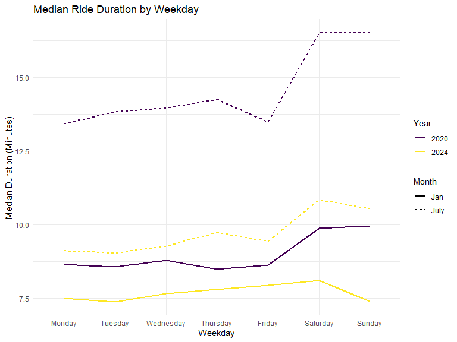

Homework 3 solutions
================
Yue Ge
2024-10-16

### Problem 1

#### Read in the data

``` r
data("ny_noaa")
```

#### Answer questions about the data

This dataset contains 2595176 rows and 7 columns. Variables include
weather station id, date of observation, (tenths of mm), snowfall (mm),
snow depth (mm), and min and max temperature (tenths of degrees C).

Below we clean the data, creating separate variables for year, month,
and day and converting `tmax` and `tmin` to numeric. We find that 0 is
the most commonly observed value for snowfall. This is because most days
of the year, it does not snow at all in NY. The second most commonly
observed value is `NA`, indicating missingness. Other common values are
13, 25, and 51, suggesting that snowfall is originally recorded in
fractions of an inch and converted to mm.

``` r
ny_noaa %>% 
  count(snow) %>%
  arrange(desc(n))
```

    ## # A tibble: 282 × 2
    ##     snow       n
    ##    <int>   <int>
    ##  1     0 2008508
    ##  2    NA  381221
    ##  3    25   31022
    ##  4    13   23095
    ##  5    51   18274
    ##  6    76   10173
    ##  7     8    9962
    ##  8     5    9748
    ##  9    38    9197
    ## 10     3    8790
    ## # ℹ 272 more rows

``` r
ny_noaa = 
  ny_noaa %>% 
  separate(date, into = c("year", "month", "day"), convert = TRUE) %>% 
  mutate(
    tmax = as.numeric(tmax),
    tmin = as.numeric(tmin))
```

Below is a two-panel plot showing the average max temperature in January
and in July in each station across years. As expected, the mean
temperature in January is much lower than the mean temperature in July
for all stations and across all years. All stations appear to follow
similar trends of temperature peaks and valleys within a month across
the years, i.e. when one station has a high monthly mean temperature for
a given year, most other stations also have a high monthly mean
temperature for that year. We do see one uncharacteristically cold
station in July of 1987 or 1988, as well as a few other less drastic
outliers.

``` r
ny_noaa %>% 
  group_by(id, year, month) %>% 
  filter(month %in% c(1, 7)) %>% 
  summarize(mean_tmax = mean(tmax, na.rm = TRUE, color = id)) %>% 
  ggplot(aes(x = year, y = mean_tmax, group = id)) + geom_point() + geom_path() +
  facet_grid(~month) +
  labs(title = "Mean monthly temperature for each station across years for January and July")
```

    ## `summarise()` has grouped output by 'id', 'year'. You can override using the
    ## `.groups` argument.


Below we show a two-panel plot including (i) a hex plot of `tmax` vs
`tmin` for the full dataset; and (ii) a ridge plot showing the
distribution of snowfall values (in mm) greater than 0 and less than 100
separately by year.

From the hex plot we see that while there is some variability, the
majority of the data cluster tightly in the center of the distribution.
In relatively rare cases, it seems that `tmax` is less than `tmin`,
which raises questions about data recording and quality.

From the ridge plot, we see a multimodal density of snowfall within a
given year. Most stations see between 0 and 35 mm of snow in a year.
Then there is a another group of stations that see about 45 mm of snow,
and another group that sees nearly 80 mm. It is likely this
multimodality stems from the conversion of measurements in one system
(fractions of an inch) to another (using the metric system), which was
also noted in the table of common values.

``` r
hex = 
  ny_noaa %>% 
  ggplot(aes(x = tmin, y = tmax)) + 
  geom_hex()

ridge = 
  ny_noaa %>% 
  filter(snow < 100, snow > 0) %>%
  ggplot(aes(x = snow, y = as.factor(year))) + 
  geom_density_ridges()

hex + ridge
```

    ## Picking joint bandwidth of 3.76


### Problem 2

#### Load, tidy, merge, and otherwise organize the data sets. Your final dataset should include all originally observed variables; exclude participants less than 21 years of age, and those with missing demographic data; and encode data with reasonable variable classes (i.e. not numeric, and using factors with the ordering of tables and plots in mind).

``` r
covar_df = 
  read_csv(
    "data/nhanes_covar.csv", 
    skip = 4, 
    na = c(".", "NA", "")) |> 
  janitor::clean_names() |> 
  mutate(
    sex = factor(sex, levels = c("1", "2"), labels = c("Male", "Female")),
    education = factor(education, levels = c("1", "2", "3"), labels = c("Less than high school", "High school equivalent", "More than high school"), ordered = TRUE)
  )
```

    ## Rows: 250 Columns: 5
    ## ── Column specification ────────────────────────────────────────────────────────
    ## Delimiter: ","
    ## dbl (5): SEQN, sex, age, BMI, education
    ## 
    ## ℹ Use `spec()` to retrieve the full column specification for this data.
    ## ℹ Specify the column types or set `show_col_types = FALSE` to quiet this message.

``` r
accel_df = 
  read_csv(
    "data/nhanes_accel.csv", 
    na = c("0", ".", "NA", "")) |> 
  janitor::clean_names() |> 
  pivot_longer(
    starts_with("min"),
    names_to = "minute",
    names_prefix = "min",
    values_to = "mims") |> 
  mutate(minute = as.numeric(minute))
```

    ## Rows: 250 Columns: 1441
    ## ── Column specification ────────────────────────────────────────────────────────
    ## Delimiter: ","
    ## dbl (1441): SEQN, min1, min2, min3, min4, min5, min6, min7, min8, min9, min1...
    ## 
    ## ℹ Use `spec()` to retrieve the full column specification for this data.
    ## ℹ Specify the column types or set `show_col_types = FALSE` to quiet this message.

``` r
final_df = 
  full_join(accel_df, covar_df, by = c("seqn")) |> 
  filter(age >= 21) |> 
  drop_na(sex, age, bmi, education) |>
  relocate(seqn, sex, age, bmi, education)
```

#### Produce a reader-friendly table for the number of men and women in each education category, and create a visualization of the age distributions for men and women in each education category. Comment on these items.

``` r
covar_df |> 
  drop_na(sex, age, bmi, education) |> 
  janitor::tabyl(sex, education) |> 
  print()
```

    ##     sex Less than high school High school equivalent More than high school
    ##    Male                    27                     36                    56
    ##  Female                    28                     23                    59

``` r
covar_df |> 
  drop_na(sex, age, bmi, education) |> 
    ggplot(aes(x = age, fill = sex)) +
      geom_density(alpha = .4, adjust = .5) +
      facet_grid(. ~ education)
```


*The number of men and women in “Less than high school” and “More than
high school”categories are alike. The number of men in “High school
equivalent” category is 50% larger than the number of women in “High
school equivalent” category.*

*The age distributions for men and women with “Less than high school”
education are quite similar, although women’s distribution appears
slightly more balanced, with smoother peaks across different age ranges.
In contrast, the “High school equivalent” category shows a mirrored
pattern between men and women. For instance, where the male density is
lower, the female density tends to be higher, particularly in certain
age bands. For individuals with “More than high school” education, the
distribution is more skewed towards younger and middle-aged women, with
a prominent peak around the age of 25–30. Meanwhile, the male
distribution in this category is broader, with fewer drastic peaks,
suggesting a more even spread across age groups.*

#### Using your tidied dataset, aggregate across minutes to create a total activity variable for each participant. Plot these total activities (y-axis) against age (x-axis); your plot should compare men to women and have separate panels for each education level. Include a trend line or a smooth to illustrate differences. Comment on your plot.

``` r
final_df |> 
  group_by(seqn) |> 
  mutate(total_activity = sum(mims, na.rm = TRUE)) |> 
  ggplot(aes(x = age, y = total_activity, color = sex)) +
    geom_point() +
    geom_smooth(method = "loess", se = FALSE) +
    facet_grid(. ~ education) +
    labs(
      title = "Total Activity vs Age by Sex and Education",
      x = "Age",
      y = "Total Activity",
      color = "Sex"
    )
```

    ## `geom_smooth()` using formula = 'y ~ x'


*Across all education levels, women tend to exhibit higher total
activity levels compared to men, particularly in younger and middle
adulthood. For both sexes, total activity generally declines with age,
although the patterns vary by education level. In the “Less than high
school” group, both men and women show a steady decline with age. In the
“High school equivalent” group, men experience a noticeable drop in
total activity around their 50s, while women maintain higher levels of
activity until older ages. In the “More than high school” group, men
have more stable but lower activity levels, while women show greater
fluctuations, with activity peaking in middle adulthood before tapering
off in older age.*

#### Make a three-panel plot that shows the 24-hour activity time courses for each education level and use color to indicate sex. Describe in words any patterns or conclusions you can make based on this graph; including smooth trends may help identify differences.

``` r
final_df |> 
  drop_na(mims) |> 
  ggplot(aes(x = minute, y = mims, group = seqn, color = sex)) +
    geom_line(alpha = 0.1, size = 0.3) +  # Individual lines for each person
    geom_smooth(aes(group = sex), method = "loess", se = FALSE, size = 1) +  # Smooth trend on top
    facet_grid(. ~ education, scales = "free_x") +  # Facet by education level
    labs(
      title = "24-hour Activity Time Courses by Education and Sex",  
      x = "Minute of the Day",  
      y = "MIMS (Activity Level)",  
      color = "Sex"
    ) +
    scale_color_manual(values = c("Male" = "#377EB8", "Female" = "#E41A1C")) +  # Custom colors
    theme_minimal() +
    theme(
      plot.title = element_text(hjust = 0.5, size = 16),  
      strip.text = element_text(size = 12),  
      axis.title.y = element_text(size = 14),  
      legend.position = "right",  
      legend.title = element_text(size = 12),  
      legend.text = element_text(size = 11),  
      panel.grid.major = element_blank(),  
      panel.grid.minor = element_blank()
    )
```

    ## `geom_smooth()` using formula = 'y ~ x'


*Across all education levels, we observe a similar pattern: a gradual
rise in activity in the morning, peaking around midday, followed by a
decline during the afternoon and evening. Participants with more than
high school education show the most intense peaks, especially in the
middle of the day. In contrast, those with less than high school
education show lower-intensity activity across the day, with both sexes
exhibiting similar trend. Notably, women tend to exhibit slightly higher
peaks compared to men across all education levels.*

### Problem 3

#### Import, clean, and tidy these data, and describe the resulting dataset.

``` r
jan_2020_citi_df =
  read_csv(
    "data/Jan 2020 Citi.csv", 
    na = c(".", "NA", "")) |> 
  janitor::clean_names() |> 
  mutate(
    year = "2020",
    month = "Jan")
```

    ## Rows: 12420 Columns: 7
    ## ── Column specification ────────────────────────────────────────────────────────
    ## Delimiter: ","
    ## chr (6): ride_id, rideable_type, weekdays, start_station_name, end_station_n...
    ## dbl (1): duration
    ## 
    ## ℹ Use `spec()` to retrieve the full column specification for this data.
    ## ℹ Specify the column types or set `show_col_types = FALSE` to quiet this message.

``` r
july_2020_citi_df =
  read_csv(
    "data/July 2020 Citi.csv", 
    na = c(".", "NA", "")) |> 
  janitor::clean_names() |> 
  mutate(
    year = "2020",
    month = "July")
```

    ## Rows: 21048 Columns: 7
    ## ── Column specification ────────────────────────────────────────────────────────
    ## Delimiter: ","
    ## chr (6): ride_id, rideable_type, weekdays, start_station_name, end_station_n...
    ## dbl (1): duration
    ## 
    ## ℹ Use `spec()` to retrieve the full column specification for this data.
    ## ℹ Specify the column types or set `show_col_types = FALSE` to quiet this message.

``` r
jan_2024_citi_df =
  read_csv(
    "data/Jan 2024 Citi.csv", 
    na = c(".", "NA", "")) |> 
  janitor::clean_names() |> 
  mutate(
    year = "2024",
    month = "Jan")
```

    ## Rows: 18861 Columns: 7
    ## ── Column specification ────────────────────────────────────────────────────────
    ## Delimiter: ","
    ## chr (6): ride_id, rideable_type, weekdays, start_station_name, end_station_n...
    ## dbl (1): duration
    ## 
    ## ℹ Use `spec()` to retrieve the full column specification for this data.
    ## ℹ Specify the column types or set `show_col_types = FALSE` to quiet this message.

``` r
july_2024_citi_df =
  read_csv(
    "data/july 2024 Citi.csv", 
    na = c(".", "NA", "")) |> 
  janitor::clean_names() |> 
  mutate(
    year = "2024",
    month = "July")
```

    ## Rows: 47156 Columns: 7
    ## ── Column specification ────────────────────────────────────────────────────────
    ## Delimiter: ","
    ## chr (6): ride_id, rideable_type, weekdays, start_station_name, end_station_n...
    ## dbl (1): duration
    ## 
    ## ℹ Use `spec()` to retrieve the full column specification for this data.
    ## ℹ Specify the column types or set `show_col_types = FALSE` to quiet this message.

``` r
citi_df = 
  bind_rows(jan_2020_citi_df, july_2020_citi_df, jan_2024_citi_df, july_2024_citi_df) |> 
  mutate(
    rideable_type = factor(rideable_type, level = c("classic_bike", "electric_bike")),
    weekdays = factor(weekdays, levels = c("Monday", "Tuesday", "Wednesday", "Thursday", "Friday", "Saturday", "Sunday")),
    member_casual = factor(member_casual, levels = c("casual", "member")),
    year = factor(year, levels = c("2020", "2024")),
    month = factor(month, levels = c("Jan", "July"))
    )
```

*The `citi_df` dataset contains data on rides in Jan 2020, July 2020,
Jan 2024, and July 2024. The dataset includes the following variables:
bike type, day of the week, ride duration, starting station, ending
station, and membership status of each ride.*

#### Produce a reader-friendly table showing the total number of rides in each combination of year and month separating casual riders and Citi Bike members. Comment on these results.

``` r
citi_df |> 
  drop_na() |> 
  janitor::tabyl(member_casual, month, year) |> 
  print()
```

    ## $`2020`
    ##  member_casual   Jan  July
    ##         casual   980  5625
    ##         member 11418 15388
    ## 
    ## $`2024`
    ##  member_casual   Jan  July
    ##         casual  2094 10843
    ##         member 16705 36200

*In both 2020 and 2024, July experiences significantly higher number of
rides than January, particularly among casual riders. Comparing 2020 to
2024, both casual and member rides increased, with casual rides more
than doubling in both January and July, and member rides growing
substantially particularly in July 2024.*

#### Make a table showing the 5 most popular starting stations for July 2024; include the number of rides originating from these stations.

``` r
july_2024_citi_df |> 
  count(start_station_name, name = "n_obs") |> 
  filter(min_rank(desc(n_obs)) < 6) |> 
  print()
```

    ## # A tibble: 5 × 2
    ##   start_station_name       n_obs
    ##   <chr>                    <int>
    ## 1 Pier 61 at Chelsea Piers   163
    ## 2 University Pl & E 14 St    155
    ## 3 W 21 St & 6 Ave            152
    ## 4 W 31 St & 7 Ave            146
    ## 5 West St & Chambers St      150

#### Make a plot to investigate the effects of day of the week, month, and year on median ride duration. This plot can include one or more panels, but should facilitate comparison across all variables of interest. Comment on your observations from this plot.

``` r
citi_df |> 
  group_by(year, month, weekdays) |> 
  mutate(median_duration = median(duration, na.rm = TRUE)) |> 
  ggplot(aes(x = weekdays, y = median_duration, group = interaction(year, month), color = year, linetype = month)) +
  geom_line(size = 1) +
  labs(
    title = "Median Ride Duration by Weekday",
    x = "Weekday",
    y = "Median Duration (Minutes)",
    colour = "Year",
    linetype = "Month"
  ) +
   theme_minimal()
```



*Rides in 2020 tend to have higher median durations compared to 2024,
particularly in July. July generally shows higher ride durations than
January, particularly on weekends (Saturday and Sunday). There is a
noticeable increase in ride duration on weekends across both years, but
more prominently in July 2020. January 2024 shows relatively consistent
ride durations across all weekdays, with little difference between
weekdays and weekends.*

#### There were relatively few electric Citi Bikes in 2020, but many more are available now. For data in 2024, make a figure that shows the impact of month, membership status, and bike type on the distribution of ride duration. Comment on your results.

``` r
citi_df |> 
  filter(year == "2024") |> 
  ggplot(aes(x = rideable_type, y = duration)) +
    geom_violin() +
    facet_grid(month ~ member_casual)
```


*Across both months, casual riders tend to have more variability and
longer ride durations compared to members. In contrast, members exhibit
shorter, more consistent ride durations, reflecting a practical,
commuting-oriented use. Electric bikes are used for relatively shorter
rides compared to classic bikes. Seasonal differences are minimal, but
July shows a slight increase in ride durations compared to January,
likely due to better weather encouraging longer trips.*
